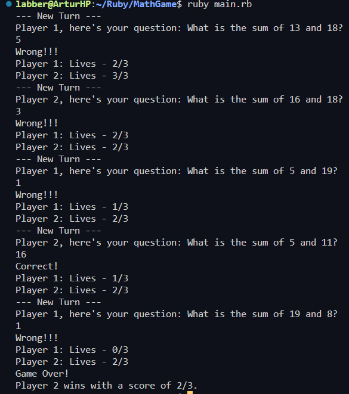

# TwO-O-Player Math Game
___
This project is a part of educational process in Web Development program by [Lighthouse Labs](https://www.lighthouselabs.ca/)

### Description
This is a 2-Player math game where players take turns to answer simple math addition problems. A new math question is generated for each turn by picking two numbers between 1 and 20. The player whose turn it is is prompted the question and must answer correctly or lose a life.


### Details
Both players start with 3 lives. They lose a life if they mis-answer a question. At the end of every turn, the game should output the new scores for both players, so players know where they stand.

The game doesn’t end until one of the players loses all their lives. At this point, the game should announce who won and what the other player’s score is.

### Example


## Getting Started

* clone repository https://github.com/mr-Arturio/MathGame
* install dependencies if needed
* run the game ```ruby main.rb```


### Customization
You can change game difficulty by changing the random number range in the *Question.rb* file, for example: ```rand(3..50)```, ```(1..10)```
Or you can add logic to let users type their names.

